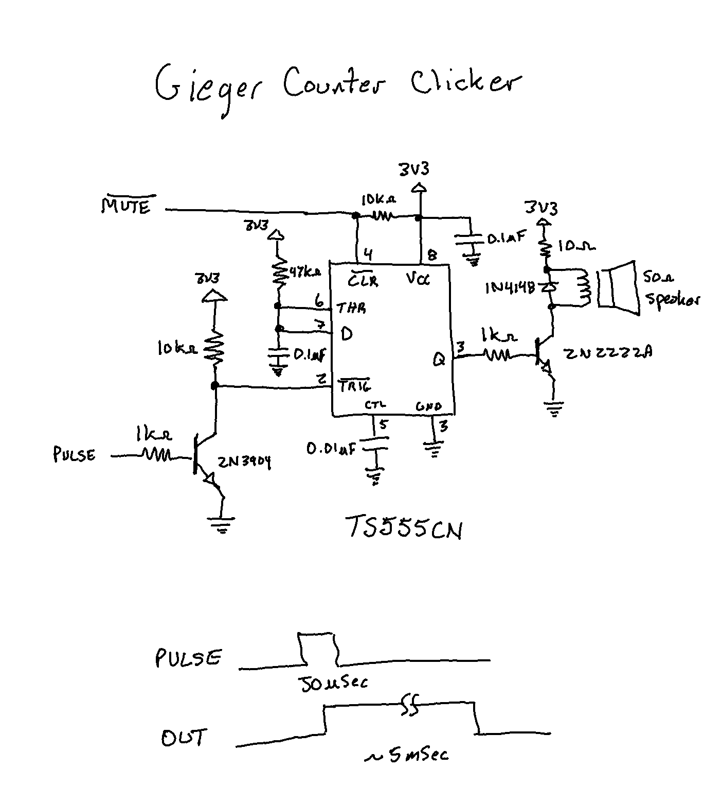

# Yet another amateur Geiger Counter
I finally indulged a small desire I've had ever since I was a kid and my neighbor, a physics professor, loaned me a geiger counter to play with for a little while.  There's something quite exciting about hearing a rising number of clicks signifying that you've come upon a source of invisible radioactive energy.


This design is based around a [LND-712](https://www.lndinc.com/products/geiger-mueller-tubes/712/) end-window alpha-beta-gamma detector that I bought from [Images Scientific Instruments](https://www.imagesco.com/geiger/geiger-counter-tubes.html). It's being driven by a [high voltage generator and pulse detector](https://www.rhelectronics.store/high-voltage-geiger-probe-driver-power-supply-module-420v-550v-with-ttl-digitized-pulse-output) from RH Electronics. Data processing and display is handled by an ESP32-based [TTGO Lilygo T-display](https://www.lilygo.cc/products/lilygo%C2%AE-ttgo-t-display-1-14-inch-lcd-esp32-control-board).  Code was written using the Espressif IDF.  A pair of hand-built boards round out the design providing  a RGB back-lit power button and '555'-based audio clicker to get those old timie geiger counter clicks (an update replaced the 555 with software because I figured not everyone may want to build the clicker circuit).

Although I'm not sure how many people will want to duplicate this exact design, I'm making it publicly available in the hopes that some parts of it may be useful to people.  Certainly it is easy to swap out various parts, such as the tube and/or HV driver for other components and still make use of the code here.


(This plate serves hot food in more ways than one)

## Features

1. Detects alpha, beta and gamma radiation
2. Theoretical range of 0 - 10000 Counts/Second (CPS) with autoscaling and dynamic averaging for responsive Counts/Minute (CPM) displays
3. Displays immediate and accumulated dosage
4. Displays Counts and roughly estimated Sivert values
5. Provides a mode to accumulate over a specified period
6. Mute control
7. Rechargeable battery with Low Battery indication (or USB power)
8. Smooth gauge needle updates (starting with firmware version 1.1)

### Accuracy note
Measuring radiation turns out to be one of those the-devil-is-in-the-details problems where a lot of things affect how accurately one is measuring a phenomena.  Like all uncalibrated units this device is not an accurate measure of actual radiation dose and should not be employed for any critical use.  A lot of smarter people than me have contemplated how to turn the pulses into some sort of measurement.  I ended up using the following three sources to decide on a conversion factor of 0.00833 for Counts/Minute to uSv/Hour for the LND-712 tube.  This can be changed in the firmware ```main/config.h``` file.

* [https://sites.google.com/site/diygeigercounter/technical/gm-tubes-supported](https://sites.google.com/site/diygeigercounter/technical/gm-tubes-supported)
* [https://www.utsunomia.com/y.utsunomia/Kansan.html](https://www.utsunomia.com/y.utsunomia/Kansan.html)
* [http://einstlab.web.fc2.com/geiger/geiger3.html](http://einstlab.web.fc2.com/geiger/geiger3.html)

## Operation
The geiger counter display has four sections.


1. Status : Battery Level / Charge indicator and Mute indicator.
2. Realtime display : Counts (CPS or CPM depending on rate) and estimated hourly dose in Siverts.
3. Accumulated display: Mode-dependent time interval, accumulated counts and dose.
4. Button Labels: Displays current function assigned to each button (left and right).

There are two modes of operation.  The current mode is displayed as the left button label.

1. MEASURE: Accumulates pulses and dose indefinitely (or until mode is changed or accumulation is reset).
2. ACCUM: Accumulates pulses and doses over a specified period and then stop accumulation.

Two buttons on the T-display dev board control operation.

1. Left Button: Short press toggles between modes.  Long press (2 seconds) mutes or unmutes audio.
2. Right Button: Short press resets accumulation results.  Long press (2 seconds) while in ACCUM mode changes accumulation periods (currently 10 minutes, 30 minutes, 60 minutes, 6 hours, 24 hours).

The RGB LEDs behind the power switch work as follows.

1. Red LED : Lit indicating power when the battery is empty (< 3.5V).
2. Green LED : Lit indicating power when the battery is not empty (> 3.5V).
3. Blue LED : Flashed for about 20 mSec for each pulse (the Red or Green LED is turned off during the flash).

### Battery Level and charging
The battery indicator gives a rough estimate of battery charge level based on battery voltage.  It changes to a charge icon when the device is powered via the USB port.

* Vbatt > 3.9V : 100%
* Vbatt > 3.72V : 75%
* Vbatt > 3.66 : 50%
* Vbatt > 3.5 : 25%
* Vbatt < 3.5 : Empty

The battery will only charge when the power switch is closed connecting the battery to the system.  The blue LED on the back of the Liligo T-display turns off when the built-in charger thinks it is done.  There might be some undercharge with this architecture because the charger chip is also powering the overall system at the same time (my unit measures about 62-65mA while running).

The ESP32 ADC is notoriously inaccurate.  I am using the IDF ```esp_adc_cal_characterize()``` function to characterize it at power-on to improve its accuracy and the operational range is within the ADC's linear region.  I think it's within 100 mV.

### MEASURE mode accumulation
Accumulation timer counts up from entry into mode or from last right button reset.  Accumulation is unbounded.

### ACCUM mode accumulation
Accumulation timer counts down from current accumulation period.  Accumulation starts on entry to mode or when reset using the right button or when accumulation period is changed.  Accumulation stops when the timer expires.

Note that accumulation periods longer than one hour should probably use an external USB power source unless you use a larger Li-Ion battery than I did.

## Hardware
This project used quite a number of components I already had so you might end up substituting here and there.  The power switch came from some old PC and has a translucent actuator so I decided to backlight it using a pair of small RGB LEDs.  I measured the LED Vf for each channel, arbitrarily picked a current of about 3mA per LED, and calculated series resistors (from 3.3V) to achieve that (then I adjusted the PWM values in the code to make nice but dimmer Red and Green colors).  Power is supplied by a PK Cell ICR10440 3.7V 350 mAh Li-Ion cell.  All of this can be changed based on the parts you have.


The overall system is a series of modules wired together.  I use 30 AWG stranded silicone wire to connect everything together because it is so flexible.


The clicker module is based around a 3.3V capable ST TS555CN chip (but any 3.3V capable 555 variant should work).  It is configured as a monostable multivibrator that takes the ~50 uSec pulse from the HV board and stretches it to about 5 mSec to drive a small 50 ohm speaker.  You might have to adjust the series resistor based on the speaker you use to limit the peak current.  I also included a 1N4148 diode is parallel with the speaker to snub the reverse voltage I saw after each click (this might not be necessary for lower impedance speakers).  The nCLR input on the 555 is used by the ESP32 to control muting.



#### Software clicker output

Starting with firmware version 1.1 the firmware generates a 2.5 mSec click output on GPIO2 (2.5 mSec on/2.5 mSec off).  This may be connected directly to a low current audio output transducer like a piezo buzzer or through a transistor driver as shown below to a higher current speaker.  This obviates the need for the 555-based clicker circuit (although the Mute signal is still generated if you want to use one).


My audio output module became the following using the software click output.


### Obligatory High-Voltage Warning
The high-voltage board from RH Electronics generates 500V (albeit at a fairly low current) and this can hurt you!  So be careful and don't touch anything on it or the connections to the tube.

### Tube Warning too!
The end of the LND-712 tube is a very thin piece of mica allowing alpha rays to pass for detection.  It is very fragile and can be damaged by touch ... so don't touch it or let anything else touch it either.  You might put a piece of tape over the hole at the end of the enclosure unless you need to detect alpha particles.

## Firmware
The firmware is built using the Espressif IDF v4.4.X.  It uses an ancient copy of LVGL (then LittlevGL) v6.1.2 to render the user interface.  It is comprised of two tasks, each running on one of the ESP32 CPUs, that communicate using events.

Set your editor for 4-character tab-stops if you want to edit the code.

### Building
After installing the IDF and configuring your shell variables as described [here](https://docs.espressif.com/projects/esp-idf/en/v4.4.7/esp32/get-started/index.html) use the following command to compile the code.

```
	idf.py build
```

The compiled code can be programmed onto the dev board using the following command.

```
	idf.py -p [SERIAL_PORT] flash monitor
```

where ```[SERIAL_PORT]``` is the dev board's serial port device file (e.g. something like ```COM9``` on windows or ```/dev/tty.wchusbserial56570368841``` on OS X).

A typical start-up output displayed by the Espressif monitor should look something like this.

```
rst:0x1 (POWERON_RESET),boot:0x13 (SPI_FAST_FLASH_BOOT)
configsip: 0, SPIWP:0xee
clk_drv:0x00,q_drv:0x00,d_drv:0x00,cs0_drv:0x00,hd_drv:0x00,wp_drv:0x00
mode:DIO, clock div:1
load:0x3fff0030,len:6996
load:0x40078000,len:17196
load:0x40080400,len:4224
0x40080400: _init at ??:?

entry 0x400806e0
I (27) boot: ESP-IDF v4.4.4-439-gc25d92074e 2nd stage bootloader
I (27) boot: compile time 13:42:13
I (27) boot: chip revision: v3.0
I (32) boot.esp32: SPI Speed      : 80MHz
I (36) boot.esp32: SPI Mode       : DIO
I (41) boot.esp32: SPI Flash Size : 16MB
I (46) boot: Enabling RNG early entropy source...
I (51) boot: Partition Table:
I (55) boot: ## Label            Usage          Type ST Offset   Length
I (62) boot:  0 nvs              WiFi data        01 02 00009000 00006000
I (69) boot:  1 phy_init         RF data          01 01 0000f000 00001000
I (77) boot:  2 factory          factory app      00 00 00010000 00100000
I (84) boot: End of partition table
I (88) esp_image: segment 0: paddr=00010020 vaddr=3f400020 size=11754h ( 71508) map
I (118) esp_image: segment 1: paddr=0002177c vaddr=3ffb0000 size=01c5ch (  7260) load
I (121) esp_image: segment 2: paddr=000233e0 vaddr=40080000 size=0cc38h ( 52280) load
I (143) esp_image: segment 3: paddr=00030020 vaddr=400d0020 size=2a8c8h (174280) map
I (194) esp_image: segment 4: paddr=0005a8f0 vaddr=4008cc38 size=00770h (  1904) load
I (203) boot: Loaded app from partition at offset 0x10000
I (203) boot: Disabling RNG early entropy source...
I (216) cpu_start: Pro cpu up.
I (217) cpu_start: Starting app cpu, entry point is 0x40081174
0x40081174: call_start_cpu1 at /Users/danjulio/esp/esp-idf-v4.4/components/esp_system/port/cpu_start.c:147

I (0) cpu_start: App cpu up.
I (233) cpu_start: Pro cpu start user code
I (233) cpu_start: cpu freq: 160000000
I (233) cpu_start: Application information:
I (238) cpu_start: Project name:     Geiger
I (242) cpu_start: App version:      1.0
I (247) cpu_start: Compile time:     Apr  4 2024 13:42:09
I (253) cpu_start: ELF file SHA256:  f66692c1ec67b9e9...
I (259) cpu_start: ESP-IDF:          v4.4.4-439-gc25d92074e
I (265) cpu_start: Min chip rev:     v3.0
I (270) cpu_start: Max chip rev:     v3.99 
I (275) cpu_start: Chip rev:         v3.0
I (280) heap_init: Initializing. RAM available for dynamic allocation:
I (287) heap_init: At 3FFAE6E0 len 00001920 (6 KiB): DRAM
I (293) heap_init: At 3FFB9028 len 00026FD8 (155 KiB): DRAM
I (299) heap_init: At 3FFE0440 len 00003AE0 (14 KiB): D/IRAM
I (305) heap_init: At 3FFE4350 len 0001BCB0 (111 KiB): D/IRAM
I (312) heap_init: At 4008D3A8 len 00012C58 (75 KiB): IRAM
I (319) spi_flash: detected chip: winbond
I (323) spi_flash: flash io: dio
I (327) cpu_start: Starting scheduler on PRO CPU.
I (0) cpu_start: Starting scheduler on APP CPU.
I (337) main: Geiger starting
I (337) cnt_task: Start task
I (337) gui_task: Start task
I (347) gpio: GPIO[36]| InputEn: 0| OutputEn: 0| OpenDrain: 0| Pullup: 1| Pulldown: 0| Intr:0 
I (347) disp_backlight: Setting LCD backlight: 100%
I (357) gpio: GPIO[15]| InputEn: 0| OutputEn: 0| OpenDrain: 0| Pullup: 1| Pulldown: 0| Intr:0 
I (367) gpio: GPIO[0]| InputEn: 0| OutputEn: 0| OpenDrain: 0| Pullup: 1| Pulldown: 0| Intr:0 
I (377) gpio: GPIO[35]| InputEn: 0| OutputEn: 0| OpenDrain: 0| Pullup: 1| Pulldown: 0| Intr:0 
I (387) gpio: GPIO[17]| InputEn: 0| OutputEn: 0| OpenDrain: 0| Pullup: 1| Pulldown: 0| Intr:0 
I (397) gpio: GPIO[14]| InputEn: 0| OutputEn: 0| OpenDrain: 0| Pullup: 1| Pulldown: 0| Intr:0 
I (407) gui_task: ADC Cal: eFuse Vref
I (417) gpio: GPIO[16]| InputEn: 0| OutputEn: 0| OpenDrain: 0| Pullup: 1| Pulldown: 0| Intr:0 
I (427) st7789: ST7789 initialization
I (627) st7789: Display orientation: LANDSCAPE
I (627) st7789: 0x36 command value: 0x60
```

Starting with firmware version 1.1 the current raw CPS and CPM values are logged every second for use by an external computer attached to the Geiger Counter via USB.

```
I (10388) cnt_task: CPS = 0, CPM = 12
I (11388) cnt_task: CPS = 0, CPM = 11
I (12388) cnt_task: CPS = 0, CPM = 10
I (13388) cnt_task: CPS = 2, CPM = 18
I (14388) cnt_task: CPS = 0, CPM = 17
I (15388) cnt_task: CPS = 2, CPM = 24
I (16388) cnt_task: CPS = 3, CPM = 84
I (17388) cnt_task: CPS = 3, CPM = 100
I (18388) cnt_task: CPS = 2, CPM = 103
I (19388) cnt_task: CPS = 2, CPM = 144
I (20388) cnt_task: CPS = 7, CPM = 190
I (21388) cnt_task: CPS = 8, CPM = 231
I (22388) cnt_task: CPS = 11, CPM = 360

```

### Programming pre-compiled firmware
Pre-compiled firmware binary files are included.  They may be loaded at the following locations using the IDF command line tool or the Espressif Windows programming tool available [here](https://www.espressif.com/en/support/download/other-tools).


| Binary File | Load Location |
| --- | --- |
| booloader.bin | 0x1000 |
| partition-table.bin | 0x8000 |
| Geiger.bin | 0x10000 |

The Espressif programming tool is setup as shown below.  Select the COM port associated with the Lilygo T-display (you may have to load a device driver for the CH9102F USB UART chip), load the files as shown (make sure to select them with the checkbox) and click START to begin programming.  You will have to power off and then repower the Lilygo after programming to start the firmware running.


### Firmware notes

1. All global configuration items are in the ```main/config.h``` file including the GPIO assignments.  The Espressif ```sdkconfig``` is pretty-much boilerplate.  I don't do any custom configuration there.
2. The application is comprised of two tasks, ```cnt_task``` and ```gui_task```, each running on one of the ESP32 cores, that communicate using events.
3. The ```cnt_task``` counts pulses from the tube and controls the LEDs.  It sends an event to the ```gui_task``` once per second indicating that it has new CPS and CPM values.  It manages a dynamic average to compute the CPM value.  This allows it to be more responsive as the geiger counter approaches and moves away from radioactive sources.  The average is computed over 5-60 seconds.
4. The ```gui_task``` controls the display, samples the buttons and monitors the battery voltage.  It sends the ```cnt_task``` events to indicate good or low battery.

### GPIO Assignment

| GPIO Pin | Description / Connection |
| --- | --- |
| GPIO 0 | Left Button on T-display (active low) |
| GPIO 2 | Click output (active high) [starting with firmware v1.1] |
| GPIO 4 | Display backlight (PWM Output) (currently unused, default 100% brigthness) |
| GPIO 5 | LCD CSN |
| GPIO 12 | Red LED Output (active high) |
| GPIO 13 | Green LED Output (active high) |
| GPIO 14 | Battery Sense circuit enable on T-display (active high) |
| GPIO 15 | Blue LED Output (active high) |
| GPIO 16 | LCD DC Output |
| GPIO 17 | Mute Output (active low) |
| GPIO 18 | LCD SPI SCK Output |
| GPIO 19 | LCD SPI MOSI Output |
| GPIO 23 | LCD RSTN Output (active low) |
| GPIO 34 | Battery Sense ADC Input (1/2 T-display internal power sense rail) |
| GPIO 35 | Right Button on T-display (active low) |
| GPIO 36 | Geiger HV Board pulse input (active high) |

### Release notes

**Firmware v1.1**

1. Log CPS and CPM to serial out
2. Implement software clicker output
3. Animate gauge needle between value updates
4. Fix bug in displayed CPM from incorrectly applied tube dead time compensation
5. Rewrite dynamic averaging algorithm to better determine when to reduce averages used to compute CPM for high rates of change involving high count rates
6. Fixed a bug where the gauge ranging logic would not move to a higher range and a count greater than the maximum was shown

## Enclosure
The enclosure was designed using OpenSCAD. It's pretty much a quick&dirty design without too much parameterization.  There is one design file but you set a variable at the top to render the piece you want to export.  I've included both the source and exported STL files.  Thanks to [cyborg_x1](https://www.thingiverse.com/thing:5246878) for the radioactive trefoil.


The only part that might need some additional explanation is the switch base.  The little board I built to carry the power switch and LEDs was wider than the base of the enclosure at its bottom and also needed to be raised a little.  So I made another part that the switch board screws into and then that part sits on the stand-offs in the enclosure base.

#### Supports for base

Add some support material when slicing the enclosure bottom part.


You might have to play with this for your printer.  I'm not sure why but I had some trouble printing the bottom part, even with support material.


My second attempt, with less support material, was better.

### Assembly

3D printed parts are sanded and painted using spray paint.  Take your time using thin layers to get the best result (unlike me, who rushed this part).  I also spray the inside of the enclosure with black paint to reduce errant light leaks.  Finally I drilled a hole in the bottom below and to the right of the USB connector for the click speaker sound to get out (I forgot to include this in the original design).

Parts go in the enclosure as shown below.


I used 3M 410S double-sided hanging tape to secure the various parts to the enclosure but you might find a better way.


The Lilygo T-display board is taped to the top.  Everything else goes in the bottom.  The tube is sandwiched between the top and bottom.  The enclosure will snap together but ultimately I used some black electrical tape along the sides to ensure it didn't pop apart if dropped.

Let me know if you build one :-)